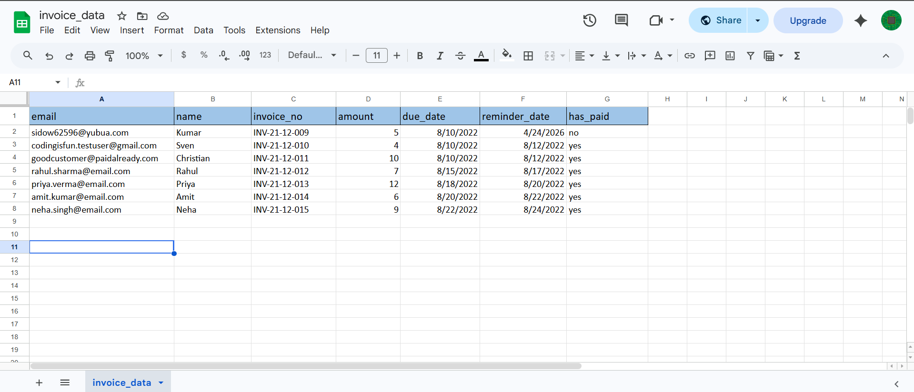
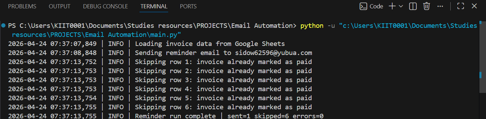

# Email Reminder Automation

Python automation that reads invoice data from a Google Sheets CSV export and sends reminder emails when a reminder date has arrived and the invoice is still unpaid.

## Features

- Reads invoice records directly from a Google Sheets CSV URL
- Validates required columns before processing
- Safely parses date fields and skips invalid rows
- Skips already paid invoices and future reminders
- Validates recipient email addresses before sending
- Uses environment variables for SMTP and sheet configuration
- Logs sent, skipped, and failed reminders for easier debugging

## Tech Stack

- Python 3.10+
- `pandas`
- `python-dotenv`
- Gmail SMTP (default, configurable)

## Project Structure

```text
.
|-- main.py
|-- send_email.py
|-- requirements.txt
|-- .env.example
|-- .gitignore
`-- README.md
```

## Expected Google Sheet Columns

Your sheet should contain these columns:

- `invoice_no`
- `name`
- `email`
- `amount`
- `due_date`
- `reminder_date`
- `has_paid`

Recommended values:

- Use valid dates for `due_date` and `reminder_date`
- Use `yes` or `no` for `has_paid`
- Store one invoice per row

## Setup

1. Clone or download the project.
2. Create and activate a virtual environment.
3. Install dependencies.
4. Create a `.env` file from `.env.example`.
5. Fill in your email credentials and Google Sheets settings.
6. Run the script.

### Windows PowerShell

```powershell
python -m venv .venv
.\.venv\Scripts\Activate.ps1
pip install -r requirements.txt
Copy-Item .env.example .env
python main.py
```

## Environment Variables

Set these values in your `.env` file:

```env
EMAIL=your-email@example.com
PASSWORD=your-email-app-password
SMTP_SERVER=smtp.gmail.com
SMTP_PORT=587
SENDER_NAME=Reminder Bot
GOOGLE_SHEET_ID=your-google-sheet-id
GOOGLE_SHEET_NAME=invoice_data
GOOGLE_SHEET_CSV_URL=
LOG_LEVEL=INFO
```

Notes:

- Use an app password for Gmail instead of your normal account password.
- `GOOGLE_SHEET_CSV_URL` is optional. If set, it overrides `GOOGLE_SHEET_ID` and `GOOGLE_SHEET_NAME`.
- Keep `.env` private. It is ignored by git.

## How It Works

1. The script loads invoice data from Google Sheets.
2. It checks that all required columns exist.
3. It parses `due_date` and `reminder_date`.
4. It skips rows with invalid data.
5. It sends reminders only when:
   - `reminder_date` is today or earlier
   - `has_paid` is not marked as paid

## Run the Project

```powershell
python main.py
```

Example log output:

```text
2026-04-24 10:00:00,000 | INFO | Loading invoice data from Google Sheets
2026-04-24 10:00:02,000 | INFO | Sending reminder email to client@example.com
2026-04-24 10:00:03,000 | INFO | Reminder run complete | sent=1 skipped=3 errors=0
```

## 📸 Demo / Screenshots

### 🧾 Google Sheets


### 📬 Email Output


### 💻 Terminal Logs


## Example Use Case

You maintain a sheet of invoices for clients. Each day, the script checks whether a reminder should be sent. If the reminder date has arrived and the invoice is still unpaid, the customer receives an email reminder automatically.

## Security Notes

- Do not commit `.env` to GitHub
- Do not hardcode passwords or SMTP credentials in Python files
- Prefer Gmail app passwords over your main Gmail password
- Review sheet-sharing settings before using a public CSV URL

## Future Improvements

- Add unit tests for data validation and email rules
- Add retry logic for temporary SMTP failures
- Update the sheet after sending an email to avoid duplicate reminders
- Support HTML templates for branded email content
- Schedule the script with Task Scheduler, cron, or GitHub Actions
